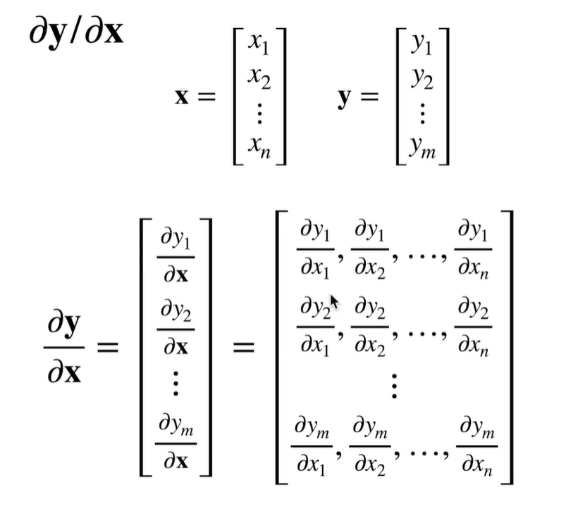
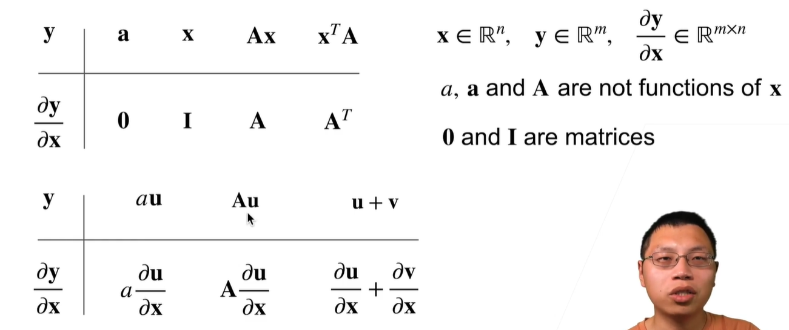

# 矩阵计算

分子布局/分母布局

## 1. **基本符号说明**

- **\( x \in \mathbb{R}^n \)**: 表示 \( x \) 是一个 \( n \) 维向量。
- **\( y \in \mathbb{R}^m \)**: 表示 \( y \) 是一个 \( m \) 维向量。
- **\( \frac{\partial y}{\partial x} \in \mathbb{R}^{m \times n} \)**: 表示 \( y \) 对 \( x \) 的导数是一个 \( m \times n \) 的矩阵，也就是 Jacobian 矩阵。

## 2. **求导公式**

图中的表格显示了几个不同的 \( y \) 函数形式，以及相应的对 \( x \) 的导数：

- **\( y = a \)**：
  - \( y \) 是一个常数标量 \( a \)。
  - 导数 \( \frac{\partial y}{\partial x} = 0 \)。
  - 解释：常数对任何变量的导数都是 0。

- **\( y = x \)**：
  - \( y \) 是向量 \( x \) 本身。
  - 导数 \( \frac{\partial y}{\partial x} = I \)（单位矩阵）。
  - 解释：变量自身对自己的导数就是单位矩阵。

- **\( y = Ax \)**：
  - \( y \) 是矩阵 \( A \) 与向量 \( x \) 的乘积。
  - 导数 \( \frac{\partial y}{\partial x} = A \)。
  - 解释：这是线性代数中的标准公式，矩阵乘法的导数规则。

- **\( y = x^T A \)**：
  - \( y \) 是向量 \( x \) 的转置与矩阵 \( A \) 和 \( x \) 的乘积（标量）。
  - 导数 \( \frac{\partial y}{\partial x} = A^T \)。
  - 解释：这是 \( x^T A x \) 的导数公式的一部分，结果是矩阵 \( A \) 的转置。

## 3. **链式法则在向量和矩阵中的应用**

下半部分展示了链式法则在向量和矩阵导数中的应用：

- **\( y = a u \)**：
  - \( u \) 是向量，对应标量 \( a \) 的乘积。
  - 导数 \( \frac{\partial y}{\partial x} = a \frac{\partial u}{\partial x} \)。
  - 解释：标量 \( a \) 乘以 \( u \) 对 \( x \) 的导数。

- **\( y = A u \)**：
  - \( u \) 是向量，对应矩阵 \( A \) 的乘积。
  - 导数 \( \frac{\partial y}{\partial x} = A \frac{\partial u}{\partial x} \)。
  - 解释：矩阵 \( A \) 乘以 \( u \) 对 \( x \) 的导数。

- **\( y = u + v \)**：
  - \( u \) 和 \( v \) 是两个向量，它们的和。
  - 导数 \( \frac{\partial y}{\partial x} = \frac{\partial u}{\partial x} + \frac{\partial v}{\partial x} \)。
  - 解释：加法规则，两个函数的和的导数等于它们各自导数的和。

这些公式和规则在机器学习和深度学习中，尤其是在反向传播算法（backpropagation）中有着广泛的应用。它们帮助我们计算损失函数相对于参数的梯度，从而进行模型的优化。
